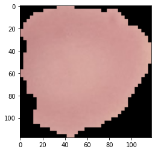
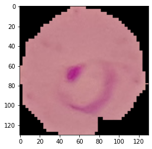

# Maleria-classifcation

It helps to classify from the cell image whether the patient has maleria or no.
It has an accuracy of 94 percent.

This is how the Uninfected cell lokks lile under microscope.

This is how the infected cell lokks lile under microscope.

